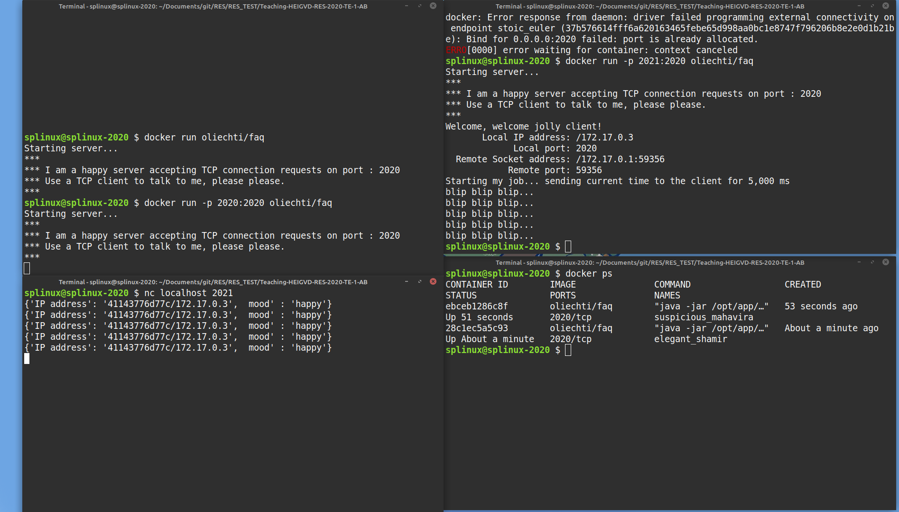

# Rendu de l'exercice Docker 

**Auteur: [prénom] [nom] (`sacha.perdrizat@heig-vd.ch`)**

## Compte rendu

Expliquez ici quelle stratégie vous avez utilisée pour vous connecter au service exécuté dans le container, en décrivant les étapes suivies:

1. docker pull oliechti/faq
2. docker run -p 2020:2020 oliechti/faq 
3. docker run -p 2021:2020 oliechti/faq
3. nc localhost 2020/2021 pour se connecter
4. docker ps pour voir les container lancées
## Capture d'écran

Assurez-vous que vous avez placé la capture d'écran dans un fichier nommé `CAPTURE-RES.png`.

## Remarques

arg